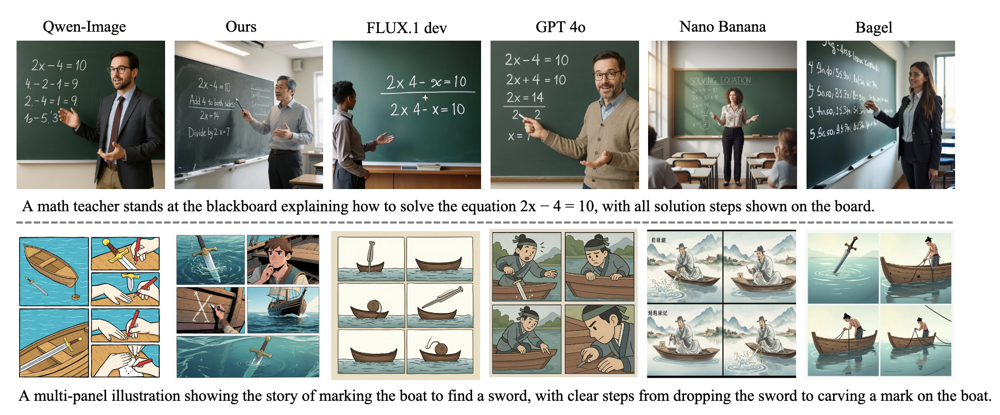
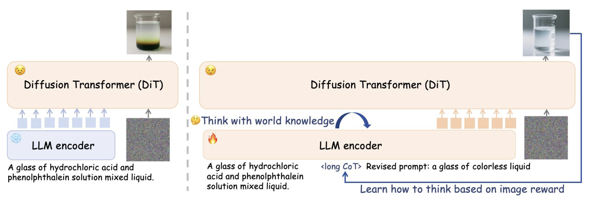

<div align="center">

# Think-Then-Generate: <br> Reasoning-Aware Text-to-Image Diffusion with LLM Encoders

[](xxx)
[](https://huggingface.co/SJTU-Deng-Lab/Think-Then-Generate-T2I/tree/main)
[](https://huggingface.co/spaces/zhijie3/think-then-generate)
[](https://zhijie-group.github.io/Think-Then-Generate/)




More results can be found in the [gallery](https://zhijie-group.github.io/Think-Then-Generate/).
</div>

---

## 🧠 How it Works
<div align="center">
  
</div>

Most existing Text-to-Image (T2I) models act as simple **text-pixel mappers**—they encode text without truly understanding it. To bridge the gap between abstract user prompts and concrete visual pixels, we propose the **Think-Then-Generate** paradigm:

1. Phase I: Reasoning Activation
   
We first activate the reasoning potential of the LLM-based text encoder via lightweight SFT. Instead of directly passing the raw prompt to the generator, the LLM is encouraged to reason about the user's intent and rewrite the prompt into a detailed, structured description that serves as conditioning for the DiT backbone.

2. Phase II: Co-Evolution via Dual-GRPO
   
To ensure the reasoning actually improves image quality, we employ **Dual-GRPO** to co-optimize both the "Brain" (LLM) and the "Painter" (DiT Backbone):

- For the LLM Encoder: It is reinforced using image-grounded rewards focusing on semantic alignment. This forces the model to activate latent world knowledge and infer precise visual details that are critical for accurate generation.

- For the DiT Backbone: It is simultaneously trained with visual realism and aesthetic quality rewards conditioned on the refined prompts. This aligns the generator's capabilities with the complex, detailed instructions produced by the LLM.


## 🛠️ Installation

Install the necessary dependencies:

```bash
pip install torch transformers diffusers accelerate
git clone https://github.com/zhijie-group/Think-Then-Generate.git
```

## 🚀 Inference

Run the model on a single GPU to experience reasoning-aware generation.

```bash
python inference.py \
  --model_path "SJTU-Deng-Lab/Think-Then-Generate-T2I" \
  --prompt "A multi-panel illustration showing the story of marking the boat to find a sword, with clear steps from dropping the sword to carving a mark on the boat." \
  --output "sword_result.jpg"

```


## 🖊️ Citation

If you find our work helpful, please consider citing:

```bibtex
@article{xxx,
  title={Think-Then-Generate: Reasoning-Aware Text-to-Image Diffusion with LLM Encoders},
  author={Authors},
  journal={arXiv preprint},
  year={2025}
}

```
